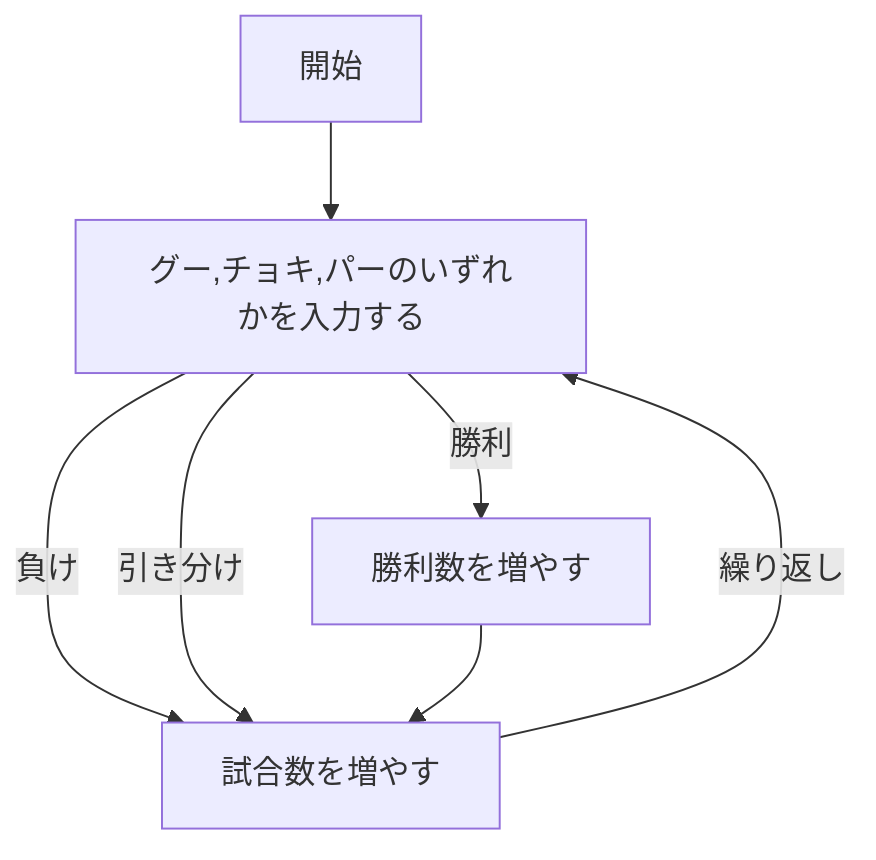

# webpro_06

## このプログラムについて

## ファイル一覧
ファイル名|説明
-|-
app5.js | プログラム本体
public/janken.html | じゃんけん開始画面
views/janken.ejs | じゃんけんのテンプレートファイル

## 使用方法
1. ```app5.js```を起動する
1. Webブラウザでlocalhost:8080/public/janken.htmlにアクセスする
1. 自分の手を入力する




