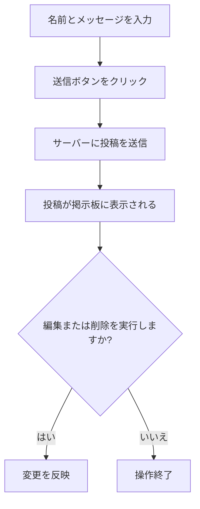
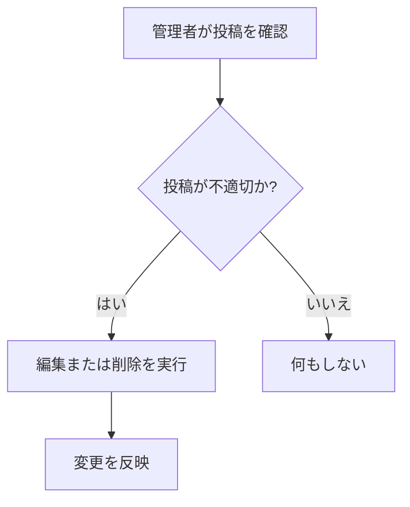
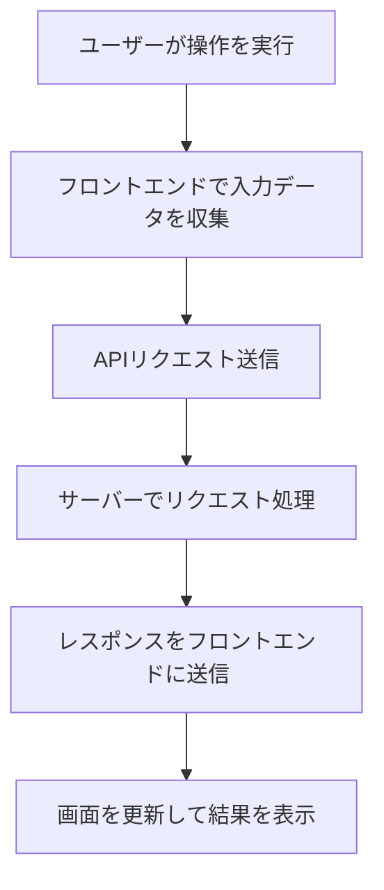

# 仕様書

## 利用者向け説明

### 概要　
この掲示板は,ユーザーが簡単にメッセージを投稿,編集.削除.検索できるツールである.投稿内容はリアルタイムで更新され,他のユーザーとも共有される.

###　主な機能
1. 投稿の作成: 名前とメッセージを入力して送信
1. 投稿の編集: 作成済みの投稿の編集
1. 投稿の削除: 不要な投稿の削除
1. 投稿の検索: キーワードを使用して投稿を絞り込み,表示
1. 新規投稿の確認:他のユーザーが追加した投稿をリアルタイムでの確認
  
### 使用方法
1. 名前とメッセージを入力して「送信」ボタンを押す.
1. 投稿内容を変更したい場合は「編集」ボタンをクリックし,新しい内容を入力する.
1. 投稿を削除する場合は「削除」ボタンをクリックし,確認画面で承認する.
1. 投稿を検索する場合は,検索バーにキーワードを入力する.
1. 新しい投稿を確認する場合は,「投稿チェック」ボタンをクリックする.

###　フローチャート

## 管理者向け説明

### 概要
管理者は掲示板の投稿を適切に管理し,不適切な投稿の削除や修正を行う.また,システム全体のセキュリティ管理や不正アクセスの監視も担当する.

### 主な管理機能
1. 投稿内容の確認と調整
・編集機能を利用して,不適切な投稿内容を修正できる.
・削除機能を利用して、ルール違反の投稿を削除できる.
1. システムログの確認
・投稿、編集、削除の履歴を確認できる.
1. セキュリティ管理
・サーバーログを確認し,不正なアクセスや攻撃を防ぐ.

###　操作手順
1. 各投稿に「編集」ボタンと「削除」ボタンが表示される.
1. 投稿を修正する場合
・「編集」ボタンをクリックする.
・ポップアップが表示されるので,新しいメッセージを入力し変更を保存する.
1. 投稿を削除する場合
・「削除」ボタンをクリックする.
・確認画面で「OK」を選択すると投稿が削除される.

###　フローチャート

### ファイル一覧
ファイル名|説明
-|-
bbs.js| ユーザーの入力を処理し,サーバーと通信
bbs.html |投稿フォーム、検索バー、投稿表示領域を定義
bbs.css |投稿のフォントやレイアウトを制御

## 開発者向け説明

### 概要
この掲示板アプリケーションは以下の技術で構築されている.
・フロントエンド:HTML,CSS,JavaScript
・サーバーサイド:REST API
・データ形式:```application/x-www-form-urlencoded```(リクエスト)及びJSON(レスポンス)

###　HTTPメソッドごとのリクエストとレスポンスの例
1. 投稿の作成(POST/post)
・目的ユーザーが新しい投稿を作成する.
・HTTPメソッド:```POST```
・リクエスト:
```
POST /post HTTP/1.1
Content-Type: application/x-www-form-urlencoded

name=太郎&message=こんにちは
```
・パラメータの詳細
　・name(文字列):投稿者の名前
　・messege(文字列):投稿の内容
・レスポンス
```
{
  "status": "success",
  "id": 1,
  "timestamp": "2024-01-01T12:00:00Z"
}
```
・パラメーターの詳細

### ファイル一覧
ファイル名|説明
-|-
bbs.js| ユーザーの入力を処理し,サーバーと通信
bbs.html |投稿フォーム、検索バー、投稿表示領域を定義
bbs.css |投稿のフォントやレイアウトを制御

###　フローチャート
